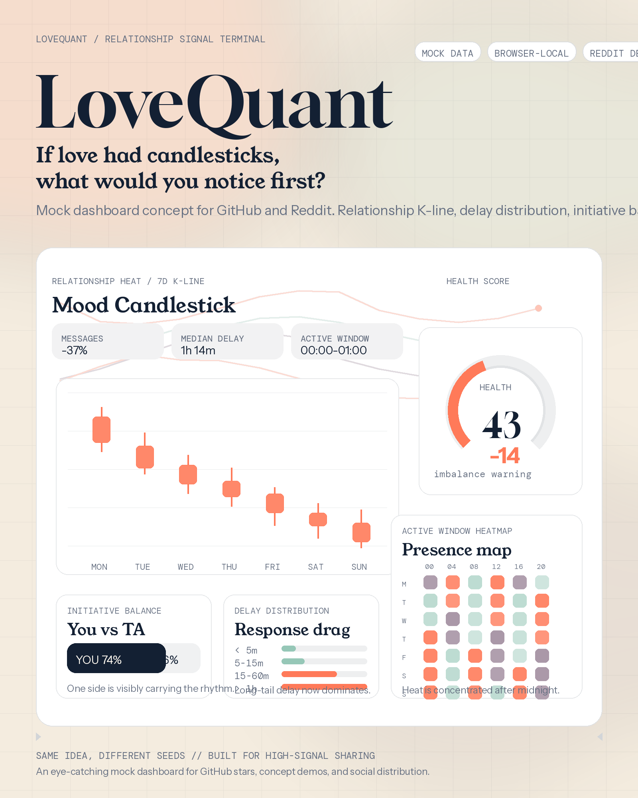

# LoveQuant

> Don't guess the relationship. Read the signal.  
> 别凭感觉，用数据读懂关系。

LoveQuant is an open-source relationship signal board that turns messaging rhythm into candlesticks, overlap heatmaps, delay distributions, anomaly markers, and action-ready reports.

This repository currently ships the interactive concept site, visual system, and product narrative for LoveQuant: a self-hosted, cross-channel relationship analytics experience designed for WeChat, WhatsApp, Telegram, iMessage, LINE, Messenger, Instagram DM, and structured imports.

[Live Demo](https://tobemagic.github.io/lovequant/) · [Market Poster](./assets/market-poster.png) · [Teaser GIF](./assets/market-teaser.gif) · [Design Philosophy](./DESIGN_PHILOSOPHY.md) · [Algorithmic Philosophy](./ALGORITHMIC_PHILOSOPHY.md)



## Why LoveQuant

- Read relationship momentum with data instead of guesswork
- See timing, message investment, initiative balance, overlap windows, and anomaly shifts in one signal language
- Support the channels couples actually use, from WeChat and WhatsApp to Telegram, LINE, iMessage, and manual exports
- Keep the stack self-hosted, inspectable, and extensible

## Highlights

- Market-style K-line timeline for 28-day relationship heat
- 7-day overlap heatmap with visible hot zones and cooling windows
- Reply delay distribution and message length trend analysis
- Initiative balance and health scoring on a single dashboard surface
- Parser demo that shows raw messages, extracted signals, and runtime flow together
- Open-source runtime map for connectors, scoring, reports, and future extensions

## Core Signals

| Signal | What it reveals | Surface |
| --- | --- | --- |
| Message Frequency | Relationship activity trend | Candlestick / trend |
| Reply Delay | Responsiveness and priority shifts | Distribution |
| Message Length | Conversation investment level | Trend |
| Initiative Balance | Who is carrying the rhythm | Split bar |
| Active Time Overlap | Shared availability windows | Heatmap |
| Health Score | Overall relationship state | Gauge |
| Anomaly Alerts | Sudden drops, spikes, or collapses | Marker list |
| AI Suggestions | What to do next | Action prompts |

## Channels and Input Modes

### Channels

- WeChat
- WhatsApp
- Telegram
- iMessage
- Messenger
- LINE
- Instagram DM
- Exported history / manual summaries

### Input Modes

1. Shared thread sync
   Metadata from a shared conversation or workspace flows into the dashboard.
2. Manual import / export
   Summaries, exports, or snapshots update the report immediately.
3. Presence + time-window signals
   Lightweight overlap signals for channels where full sync is not ideal.

## What This Repo Contains Today

- A polished interactive homepage in [`lovequant-demo/`](./lovequant-demo/)
- A GitHub Pages deployment workflow in [`.github/workflows/deploy-pages.yml`](./.github/workflows/deploy-pages.yml)
- Visual and narrative references in [`themes/`](./themes/), [`art/`](./art/), and [`assets/`](./assets/)
- Product positioning, brand direction, and signal design notes in this root directory

## Self-Hosted Model

LoveQuant is designed to be run on your own stack.

- Bring your own adapters for exports, APIs, bots, or manual imports
- Keep ingestion, normalization, scoring, and reporting logic auditable
- Control storage format, retention, and report outputs yourself
- Extend the dashboard into reports, alerts, bots, or custom views

## Repo Layout

```text
.
├── .github/workflows/      # GitHub Pages deployment
├── art/                    # Concept artifacts and visual references
├── assets/                 # Poster and teaser assets
├── lovequant-demo/         # Vite + React interactive site
├── themes/                 # Theme notes and direction
├── DESIGN_PHILOSOPHY.md    # Visual system notes
└── ALGORITHMIC_PHILOSOPHY.md
```

## Development Direction

The current repo focuses on the product surface first: narrative, interaction, dashboard language, and the self-hosted mental model.

The next layer is runtime implementation:

- source adapters
- metadata ingestion
- scoring engine
- report generation
- export and automation hooks

## License

Add your preferred open-source license before wider distribution.
